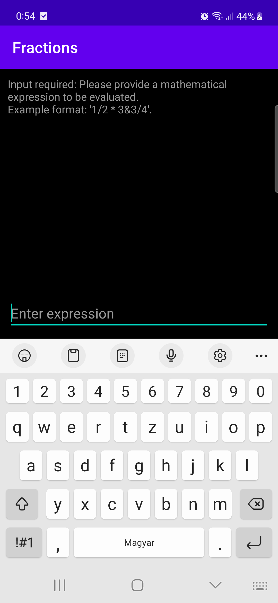
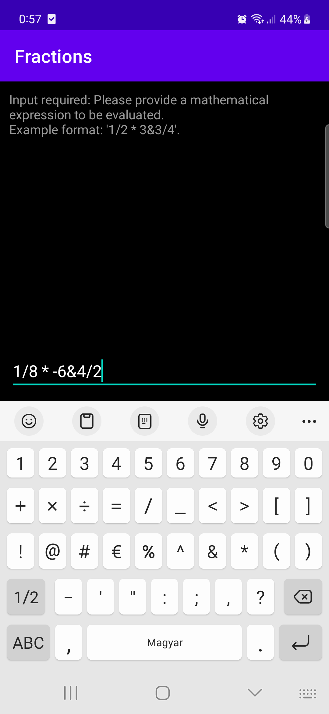
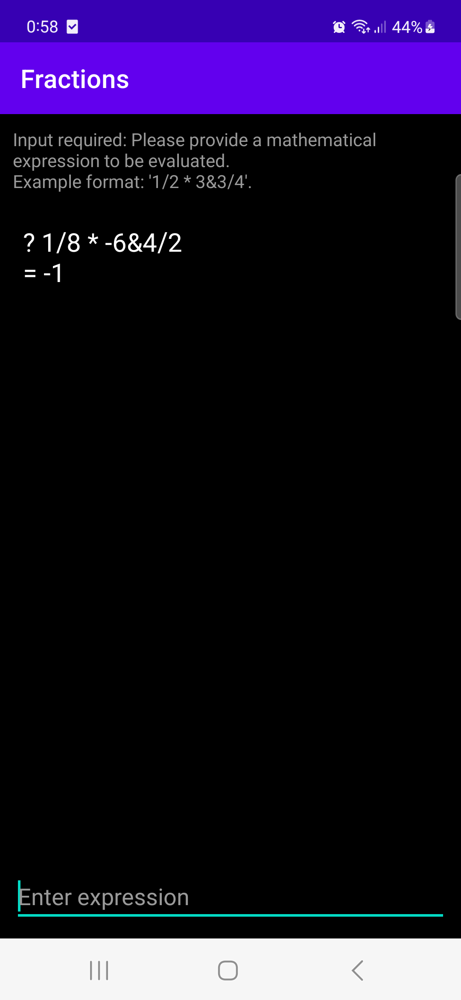

# Fractions

## Table of Contents
  - [Description](#description)
    - [Example](#example)
    - [Notes](#notes)
  - [Installation](#installation)
    - [Download Executables](#download-executables)
    - [Building the Console Application](#building-the-console-application)
    - [Building the Android Application](#building-the-android-application)
    - [Building and Running Unit Tests](#building-and-running-unit-tests)
  - [Using the Core Library in Your Projects](#using-the-core-library-in-your-projects)
  - [Documentation](#documentation)
  - [Screenshots](#screenshots)

## Description
Fractions is an application that takes operations on fractions as input and produces a fractional result. 

### Example
Example usage (where '?' represents the command prompt):

? 1/2 * 3&3/4  
= 1&7/8

### Notes
- Supported operators are `*`, `/`, `+`, `-` (multiply, divide, add, subtract).
- Operands and operators must be separated by one or more spaces.
- Mixed numbers should be represented in the form `whole&numerator/denominator`. For example, "3&1/4", "-1&7/8".
- Improper fractions, whole numbers, and negative numbers are allowed as operands.

## Installation

### Download Executables
If you don't want to compile the application yourself, you can download the latest release. The release includes a Console Application, an Android Application, and the core library built for Windows and Android.  
You can download the latest release of the project [here](https://github.com/bodaiboka/fractions/releases/latest).

- The Console Application can be launched by double-clicking on it or typing its name in a terminal.
- To install the Android Application, copy the `.apk` file to your device and install it by tapping on it. Note: You might need to enable installation from unknown sources in your settings.

### Building the Console Application
To build the Console Application, follow these steps:
1. Install `cmake`.
2. Add `cmake` to the PATH environment variable.
3. Install `MinGW`.
4. Add `MinGW` to the PATH environment variable.
5. Build the fractions library located in the `libFractional` directory by running the `build_windows_release.bat` script. It will create the required static library for the Console Application.
6. Build the Console Application in the `app/windows` directory by running the `build.bat` batch file.
7. After successful compilation, the executable should appear in the `app/windows` directory as `app.exe`.  

__Note:__ As an alternative, if you don't intend to modify the library code, you can download the latest release and copy `libfractional.a` into the `app/windows` directory. Then compile the Console Application. Make sure to update the library path in the build.bat file before compiling the Console Application.

### Building the Android Application
To build the Android Application, follow these steps:
1. Install Android NDK.
2. Create an environment variable named `ANDROID_NDK`, and set its value to the path of the Android NDK.
3. Install `cmake`.
4. Add `cmake` to the PATH environment variable.
5. Install `MinGW`.
6. Add `MinGW` to the PATH environment variable.
7. Build the fractions library located in the `libFractional` directory by running the `build_android_release.bat` script. This will create the required shared library and copy it into the Android project.
8. Open the Android Project located in `app/android` with Android Studio and build the application.

__Note:__ Alternatively, if you don't plan to modify the library code, you can simply download the latest release, and copy the `jniLibs` directory into `app/android/app/src/main`. Then, compile the Android Application using Android Studio.

### Building and Running Unit Tests

This project includes unit tests that are written using the [GoogleTest](https://github.com/google/googletest) framework. If you would like to build and run the tests, or contribute by adding more tests, follow the steps below:

#### Prerequisites

- [CMake](https://cmake.org/download/) (version 3.8 or higher)
- A C++ compiler compatible with C++11

#### Steps

1. **Clone GoogleTest**: Clone the GoogleTest repository from GitHub. You can do this by running `git clone https://github.com/google/googletest.git` in your terminal or command prompt.

2. **Build and Install GoogleTest**: Change to the cloned `googletest` directory, and then use CMake to build and install it.
    ```sh
    cd googletest
    mkdir build
    cd build
    cmake ..
    cmake --build .
    cmake --install .
    ```
    
3. **Set Environment Variable**: Create an environment variable named `GOOGLE_TEST` and set its value to the path where GoogleTest was installed. This will allow the build script to find the GoogleTest libraries. In case you do not define this variable, CMake is configured to skip building the test application.

4. **Build the Test Application (Windows)**: If you are on Windows, run the provided batch script `build_windows_release.bat`. This script will build the library and link it to the test application.
    ```sh
    build_windows_release.bat
    ```
    *Note: The test application will be placed in the `build/windows-release/tests` directory.*

5. **Run the Tests**: To execute the tests, navigate to the build directory and use the `ctest` command or directly execute the test application.
    ```sh
    cd build/windows-release/tests
    ctest
    # or
    Fractional_Tests.exe
    ```

By following these steps, you should be able to build and run the unit tests.

## Using the core library in Your Projects
If you wish to incorporate the core library into your own projects, first build the library for either Windows or Android by utilizing the appropriate script file within the libFractional directory.

The core functionality of this library can be accessed through the std::string produce_fractional_result(std::string input) function. This function accepts an input string consisting of a fractional expression and returns the resultant fraction as a string.

### Note for Android Projects
When integrating the core library into an Android project, a custom JNI (Java Native Interface) wrapper will be required. Ensure that the JNI wrapper is tailored to suit your package name and the specific class where the library is loaded. This is essential for establishing the connection between the Java code and the native library functions.

## Documentation

The `docs` directory contains supplementary documentation and resources for the project.
- Flowchart: A flowchart depicting the structure and flow of the Console Application is available as an HTML file named `flowchart.html`. You can also view the flowchart online by clicking [here](https://bodaiboka.github.io/fractions/flowchart.html).
- Screenshots: Screenshots showcasing the Android Application can be found in the `docs/android/screenshots` directory. These images provide visual insight into the features and interface of the app.

## Screenshots
<p align="center">





</p>


